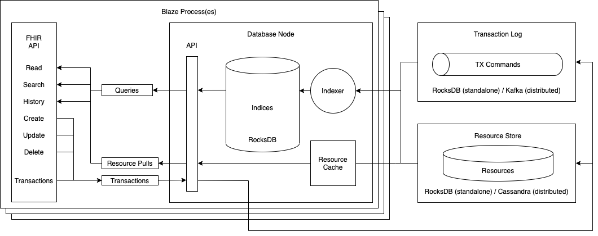

# Architecture

The following figure shows the overall architecture of Blaze.

In this architecture, the [FHIR API][8] on the left is supported by the Queries, Resource Pulls and Transactions functionalities, provided by the Database Node API. The Database Node itself consists of an embedded [RocksDB][1] key-value store that holds all Indices required to answer the queries and an Indexer that creates those indices from transactions. The Resource Pulls functionality accesses the Resource Store directly, which is a key-value store from resource content hash (key) to resource content (value). The Transactions functionality pushes transaction commands to the Transaction Log and resource content hashes and resource contents to the Resource Store. The Transaction Log can be standalone (RocksDB) or distributed (Kafka). In both cases only one single Transaction Log exists. The transaction commands will be streamed into the Indexer that also fetches resources from the Resource Store in order to create the local Indices.

## Transaction Log

The Transaction Log is a central component in Blaze. it is used to ensure [ACID][2] (atomicity, consistency, isolation, durability) properties of Blaze by maintaining a total order of all transactions which corresponds to the isolation level [Serializable][3].

In the standalone deployment scenario, the Transaction Log is backed by RocksDB and embedded in the overall Blaze Process, in order to keep it simple and use the same technology that the Indices use already. However other implementations are possible.

In the distributed case a single [Kafka][4] topic with a single partition is used to ensure the total order of transaction commands while multiple Database Nodes write into this topic. Performance wise, the single topic is no problem, because the transaction commands are small.

## Resource Store

The Resource Store holds all versions of all resources by their content hash. This approach is similar to Git which keeps commits by their SHA1 content hashes. Using the content hash instead of the resource id ensures key-value pairs are never updated and so are easily cacheable. On top of that, older versions of resources are still available for the [FHIR History][7] interactions. 

In the standalone deployment scenario, the Resource Store is embedded and backed by RocksDB for the same reason why the Transaction Log uses RocksDB. Again other implementations are possible.

In the distributed case a [Cassandra][5] database is used. However adapters for any suitable central key-value store could be implemented. Even relational databases like Postgres would be possible. Cassandra was chosen as first implementation, because it can be deployed in a cluster, so that it will scale and be high available.

## Database Node

As written already above, the Database Node represents the data access layer in Blaze. In the distributed deployment scenario, a Database Node will exist in every Blaze Process. This also means that every Blaze Process contains it's own set of Indices and can answer Queries without relaying on central resources. Only at the point were resources actually should be returned by the FHIR API, and a cache miss in the Resource Cache happens, access to the central Resource Store is needed. The Transaction Log is not needed for Queries and Pulls at all.

One important note is, that Blaze uses full replication over all Database Nodes. In order to ensure full consistency and keep the implementation simple, sharding isn't a feature of Blaze yet. That means that the storage requirements for the Indices grow with the number of Database Nodes deployed.

## Blaze Process

Each Blaze Process runs in a [JVM][6]. In the standalone case, in addition to the FHIR API and the Database Node, the Blaze Process contains also the Transaction Log and the Resource Store. In the distributed case, both the Transaction Log and the Resource Store will run in separate processes, meaning in the respective processes of their implementations.

## Other Work

The architecture of Blaze is inspired by the architecture of [XTDB][9] but optimized for the FHIR use-case.

[1]: <https://rocksdb.org>
[2]: <https://en.wikipedia.org/wiki/ACID>
[3]: <https://en.wikipedia.org/wiki/Isolation_(database_systems)#Serializable>
[4]: <https://kafka.apache.org>
[5]: <https://cassandra.apache.org>
[6]: <https://en.wikipedia.org/wiki/Java_virtual_machine>
[7]: <https://www.hl7.org/fhir/http.html#history>
[8]: <https://www.hl7.org/fhir/http.html>
[9]: <https://xtdb.com>
