# CQL Queries

## Install the Quality Reporting UI

The most accessible way to create and execute CQL queries is to use the Quality Reporting UI. The Quality Reporting UI is a desktop application which you can download [here](https://github.com/samply/blaze-quality-reporting-ui).

## Run Blaze

If you don't already have Blaze running, you can read about how to do it in [Deployment](deployment/). If you have Docker available just run:

```
docker run -p 8080:8080 -v blaze-data:/app/data samply/blaze:0.10.0-alpha.2
```

Start the Quality Reporting UI. You should see an empty measure list.

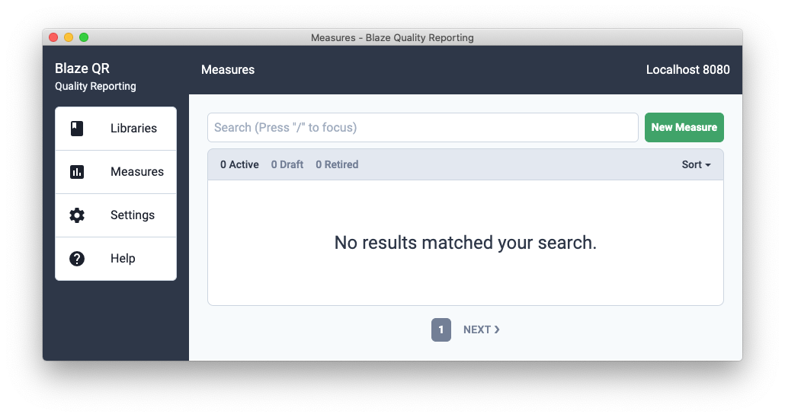

In the upper right corner, you see **Localhost 8080**. If Blaze runs on Localhost port 8080, you can continue, otherwise you have to go into Settings and add your Blaze servers location.

### Add Your Blaze Server

Go into **Settings** and click on **Add**.

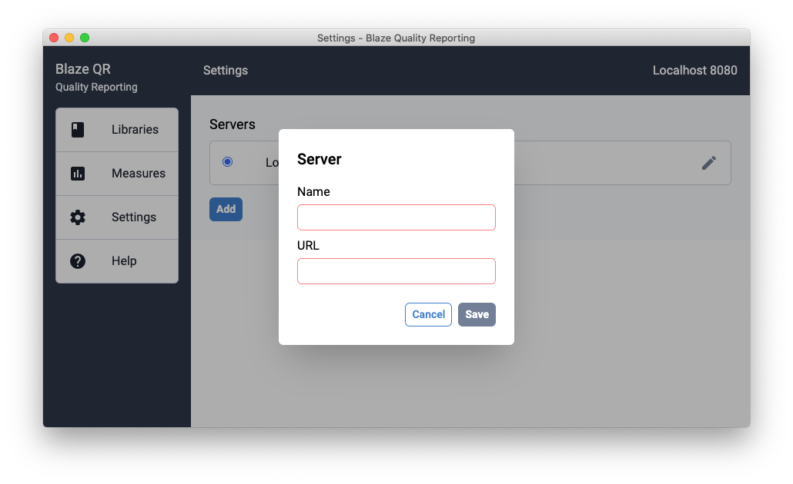

Enter a **Name** and a **URL**. Please be aware that URLs of Blaze FHIR endpoints have the path `/fhir` in it by default. You can find your FHIR endpoint URL of Blaze in the logs in a line like this:

```text
Init FHIR RESTful API with base URL: http://localhost:8080/fhir
```

### Create Your First Library

Blaze uses the FHIR [Quality Reporting](https://www.hl7.org/fhir/clinicalreasoning-quality-reporting.html) Module, to execute CQL queries. In Quality Reporting, CQL Query Expressions reside in [Library](https://www.hl7.org/fhir/library.html) resources and are referenced in [Measure](https://www.hl7.org/fhir/measure.html) resources. In order to create a Library resource, go to **Libraries** and click on **New Library**.

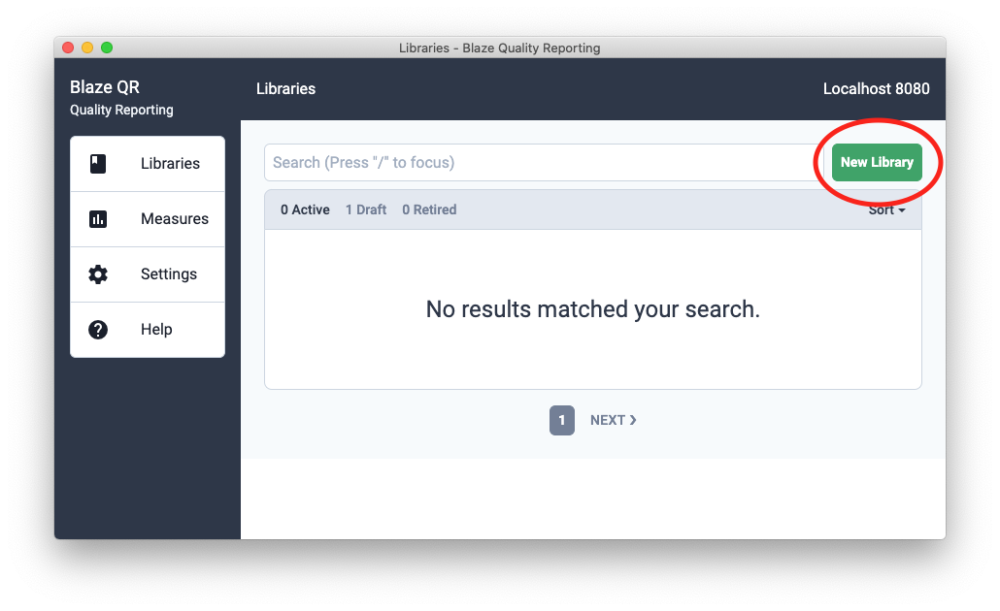

After you created your Library, you can give it a name by clicking at **Edit:**


After naming your Library, you have to give it a canonical URL. We just use localhost for our URL here:

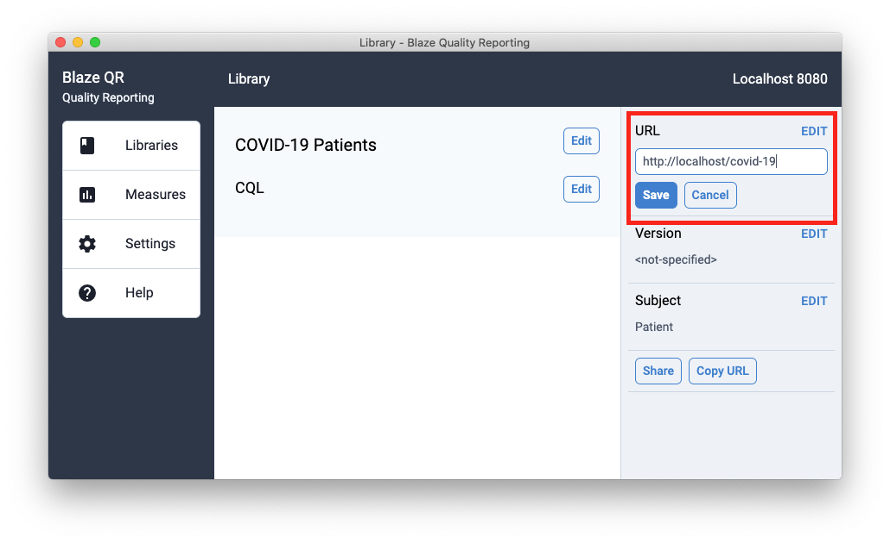

Next we add the CQL source code for our single **InInitialPopulation** query expression: 

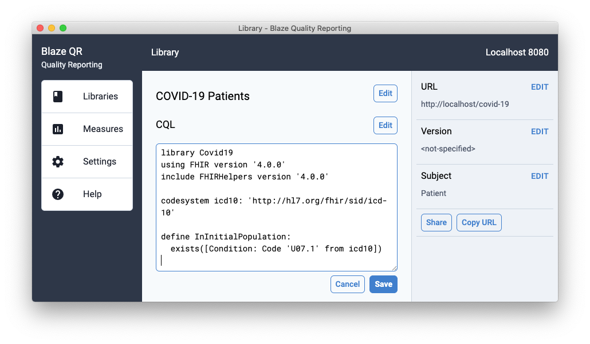

```text
library Covid19
using FHIR version '4.0.0'
include FHIRHelpers version '4.0.0'

codesystem icd10: 'http://hl7.org/fhir/sid/icd-10'

define InInitialPopulation:
  exists([Condition: Code 'U07.1' from icd10])
```

### Create Your First Measure

You can create Measure resources under **Measures** by clicking on **New Measure**. After giving our Measure a name, we also have to give it a canonical URL:

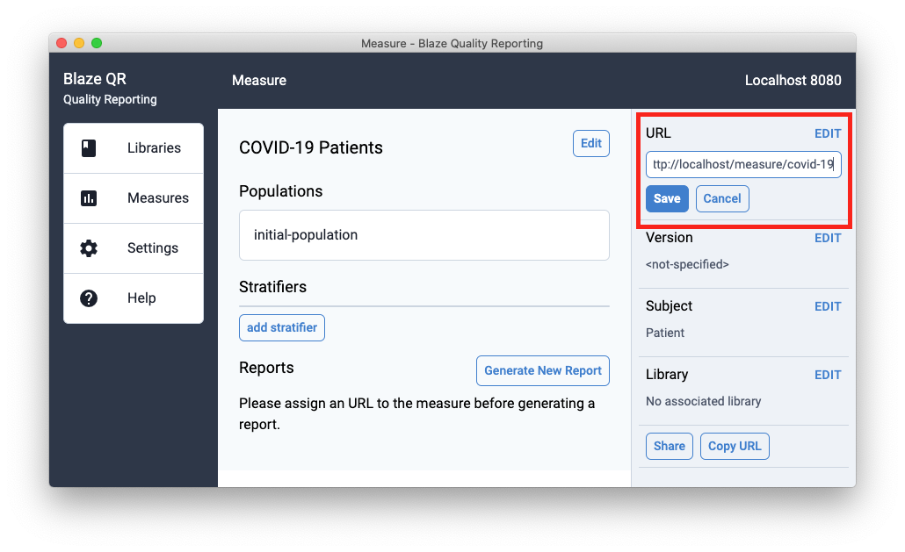

After that, we have to reference our previously created Library to our Measure by clicking on the **Edit** button in the right sidebar:

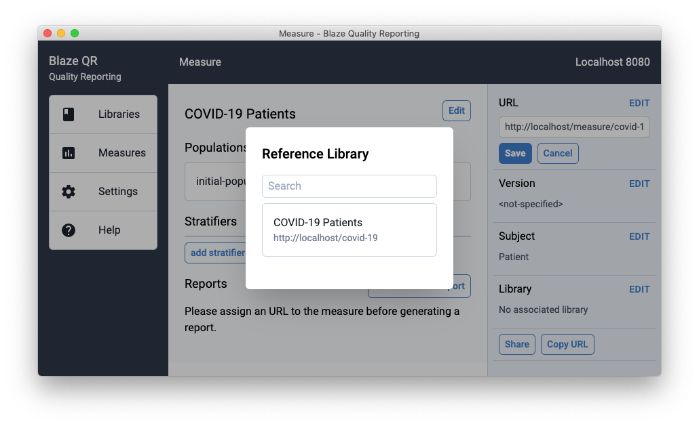

Because the Measure comes with an initial population definition by default, we will only check it by clicking on **initial-population**:


Here we see our CQL expression **InInitialPopulation** from our Library referenced:

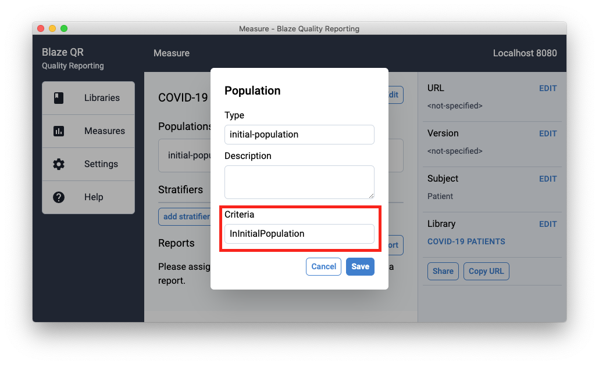

### Generating a First Report

To generate a Report, we click on **Generate New Report**:


After some time, a MeasureReport will appear in the list of reports of our Measure:

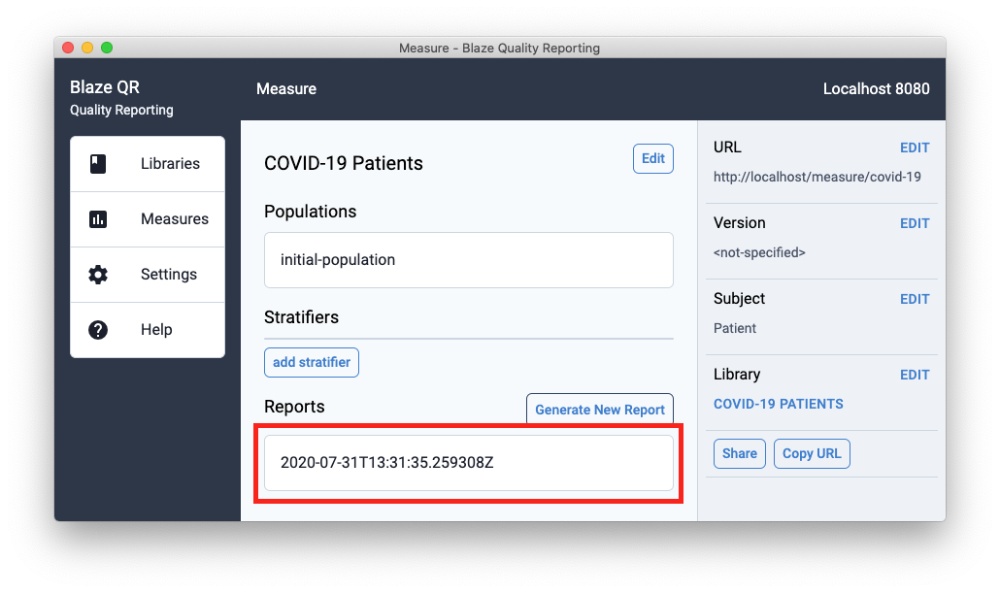

Please be patient, because currently there is no progress bar. If nothing appears for a long time, you can use the menu to go back to all measure, open our measure again and look if ou see a report with a fitting timestamp.

All reports are persisted in Blaze and are shown in the UI with their creation timestamp.

After you open the report, you will see that your **initial-population** has a count of zero.

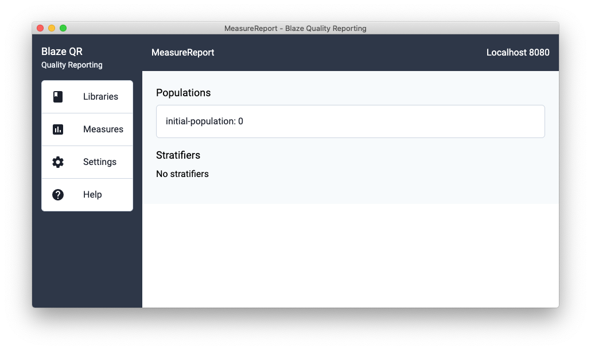

### Import Patients with COVID-19 Diagnoses

If you POST the following Bundle to the transaction endpoint of Blaze, you will have two patients, one with a COVID-19 condition and one without:

```text
{
  "resourceType": "Bundle",
  "type": "transaction",
  "entry": [
    {
      "request": {
        "method": "PUT",
        "url": "Patient/0"
      },
      "resource": {
        "resourceType": "Patient",
        "id": "0"
      }
    },
    {
      "request": {
        "method": "PUT",
        "url": "Condition/0-condition"
      },
      "resource": {
        "resourceType": "Condition",
        "id": "0-condition",
        "code": {
          "coding": [
            {
              "code": "U07.1",
              "system": "http://hl7.org/fhir/sid/icd-10",
              "version": "2016"
            }
          ]
        },
        "subject": {
          "reference": "Patient/0"
        }
      }
    },
    {
      "request": {
        "method": "PUT",
        "url": "Patient/1"
      },
      "resource": {
        "resourceType": "Patient",
        "id": "1"
      }
    }
  ]
}
```

After importing patients, the result of the initial population will be one:

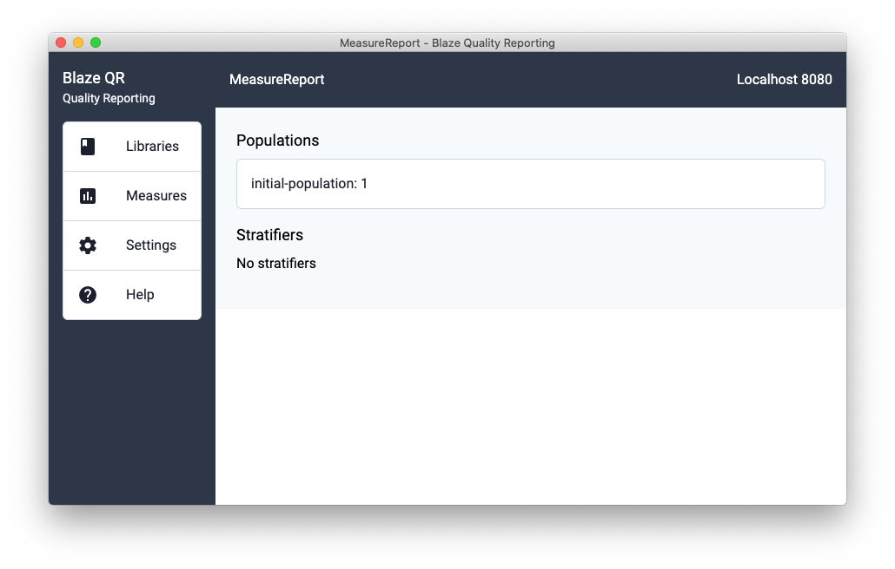

You can learn more about CQL queries in the [Author's Guide](https://cql.hl7.org/02-authorsguide.html) at HL7.

