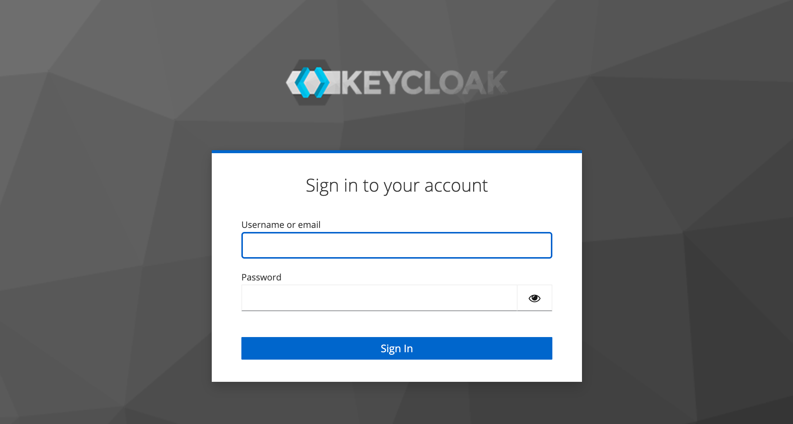
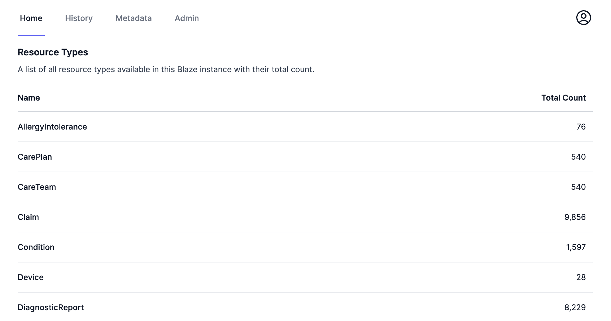

# Full Standalone Deployment

The full standalone setup consists of a frontend and a single standalone backend. 

The architecture is shown in the following figure.


Please also have a look into the [architecture](../architecture.md) and [authentication](../authentication.md) documentation.

## Example Setup

The `docs/deployment/full-standalone` directory contains a Docker Compose file with an example system consisting of all components needed in a full standalone setup.

> [!CAUTION]
> The Docker Compose setup shown here contains publicly known passwords and secrets. Please don't use it in production without changes.

> [!NOTE]
> You will need about 16 GB of RAM to be able to run the example smoothly. 

Before you can start the system, you have to generate certificates for the ingress component. To do so, please go into the base directory of this Blaze repository and run:

```sh
make build-ingress
```

Two certificates and one trust store should be generated in the `modules/ingress` directory. The files will be referenced from that directory, you don't have to copy them.

After you have created the certificates, you can start the system by going into the `docs/deployment/full-standalone` directory and run:

```sh
docker-compose up -d keycloak
```

first, because it needs to be fully started before the Blaze components can start to avoid waiting an additional minute for Blaze fetching the Keycloak config again. After Keycloak runs, start the rest of the components:  

```sh
docker-compose up -d
```

Watch all components to start completely by looking into the log output:

```sh
docker-compose logs -f
```

In your browser, please go to `https://blaze.localhost/fhir`. 

> [!NOTE]
> The hostname `blaze.localhost` doesn't work in Safari.

> [!IMPORTANT]
> You have to accept certificate violations in your browser twice, once for the `blaze.localhost` domain and once for the `keycloak.localhost` domain.

You should see a big button with the text "Sign in with Keycloak":


Press it and you will be redirected to the Keycloak sign-in page:



Enter username "john" and password "insecure" and press "Sign In". After that you will be redirected to the home page:


In the top right, you will see the user menu were you can sign out again.


### Performing Authorized API Requests

After the UI works, with authentication via Keycloak, we need to be able to perform authorized API requests via curl and [blazectl][1]. Other REST API clients should work similar.

For API requests [OAuth 2 Client Credentials Grant][2] should be used in order to obtain an access token. The bash script `docs/deployment/full-standalone/fetch-access-token.sh` can be used to fetch an access token. By default is uses the client `account` present in the example keycloak config.

Now that we are able to obtain an access token, we can use curl to count the number of resources available in Blaze:

```sh
curl -sk --oauth2-bearer "$(./fetch-access-token.sh)" 'https://blaze.localhost/fhir?_summary=count'
```

After that works, we can also use blazectl to do the same:

> [!IMPORTANT]
> You need at least blazectl v0.14.0.

```sh
blazectl -k --server https://blaze.localhost/fhir --token "$(./fetch-access-token.sh)" count-resources
```

Last but not least, we can import data using blazectl:

```sh
blazectl -k --server https://blaze.localhost/fhir --token "$(./fetch-access-token.sh)" upload ../../../.github/test-data/synthea
```

After importing data, we should see resource counts also in the UI:



### Docker Compose Components Explained

#### Ingress

An nginx server is used as the ingress component. You should see the configuration of the nginx as guideline and example and not use it 1:1 in production.

```yaml
ingress:
  image: "nginx:1.25.4"
  environment:
    BLAZE_HOST: "blaze.localhost"
    KEYCLOAK_HOST: "keycloak.localhost"
  ports:
  - "443:443"
  volumes:
  - "../../../modules/ingress/default.conf.template:/etc/nginx/templates/default.conf.template:ro"
  - "../../../modules/ingress/blaze-cert.pem:/etc/nginx/conf.d/blaze-cert.pem:ro"
  - "../../../modules/ingress/blaze-key.pem:/etc/nginx/conf.d/blaze-key.pem:ro"
  - "../../../modules/ingress/keycloak-cert.pem:/etc/nginx/conf.d/keycloak-cert.pem:ro"
  - "../../../modules/ingress/keycloak-key.pem:/etc/nginx/conf.d/keycloak-key.pem:ro"
```

The two environment variables `BLAZE_HOST` and `KEYCLOAK_HOST` are used in the `modules/ingress/default.conf.template` file. The entrypoint of the nginx container will expand the template into the actual `/etc/nginx/conf.d/default.conf` file.

The two separate virtual hosts are used to separate the Blaze web origin from that of Keycloak. Separating both web origins is important for security. Otherwise cookies might be visible between both the Blaze and Keycloak web UI. In a production setup it's recommended to further separate the Keycloak installation from that of Blaze. Keycloak should be part of your general IT infrastructure and not part of Blaze.

The other mounted files are the certificates and private keys for the two virtual hosts.

More in depth information about the nginx configuration can be found in the README of the ingress module.

### Frontend

The frontend of Blaze runs as separate container. It will talk to the backend directly over HTTP inside the Docker network and to Keycloak over HTTPS. It is stateless and scaled to multiple instances. Scaling the backend in documented [here](./distributed-backend.md).

```yaml
frontend:
  image: "samply/blaze-frontend:latest"
  environment:
    ORIGIN: "https://blaze.localhost"
    BACKEND_BASE_URL: "http://backend:8080"
    AUTH_CLIENT_ID: "account"
    AUTH_CLIENT_SECRET: "e11a3a8e-6e24-4f9d-b914-da7619e8b31f"
    AUTH_ISSUER: "https://keycloak.localhost/realms/blaze"
    AUTH_SECRET: "666df42c74ce1f4728fe2ffe99b146e0f2e4b4f9810594fcf68c0330495bca0f"
    PROTOCOL_HEADER: "x-forwarded-proto"
    HOST_HEADER: "x-forwarded-host"
    NODE_EXTRA_CA_CERTS: "/app/keycloak-cert.pem"
  extra_hosts:
  - "keycloak.localhost:host-gateway"
  volumes:
  - "../../../modules/ingress/keycloak-cert.pem:/app/keycloak-cert.pem:ro"
```

The documentation of the environment variables can be found [here](./environment-variables.md).

> [!CAUTION]
> Please don't use the same secrets in production.

### Backend

```yaml 
backend:
  image: "samply/blaze:latest"
  environment:
    JAVA_TOOL_OPTIONS: "-Xmx2g"
    LOG_LEVEL: "debug"
    ENABLE_ADMIN_API: "true"
    OPENID_PROVIDER_URL: "https://keycloak.localhost/realms/blaze"
    OPENID_CLIENT_TRUST_STORE: "/app/keycloak-trust-store.p12"
    OPENID_CLIENT_TRUST_STORE_PASS: "insecure"
  extra_hosts:
  - "keycloak.localhost:host-gateway"
  volumes:
  - "blaze-data:/app/data"
  - "../../../modules/ingress/keycloak-trust-store.p12:/app/keycloak-trust-store.p12:ro"
```

Important environment variables are `ENABLE_ADMIN_API` and `OPENID_PROVIDER_URL`. Both are feature toggles that enable features needed by the frontend. The `OPENID_PROVIDER_URL` should be set to the same value as `AUTH_ISSUER` at the frontend. The `OPENID_CLIENT_TRUST_STORE` is only needed if the server certificate of Keycloak isn't signed by a standard certificate authority. The file `keycloak-trust-store.p12` is generated in the ingress module. You can use similar scripts to generate the trust store in your environment. Full documentation of the environment variables can be found [here](./environment-variables.md).

### Keycloak Auth Provider

For Keycloak the realm `docs/deployment/full-standalone/keycloak/import/realm-blaze.json` is imported at startup. It contains a client with the name `account` and secret `e11a3a8e-6e24-4f9d-b914-da7619e8b31f` and a user with name `john` and password `insecure`.

> [!CAUTION]
> Please don't use this realm in production.

On top of the realm an admin user with name `admin` and password `admin` is configured. You can go to `https://keycloak.localhost/admin` and modify settings. More in-depth configuration of Keycloak it out of scope of the Blaze documentation.

```yaml
keycloak:
  image: "quay.io/keycloak/keycloak:24.0.1"
  command: "start --import-realm --hostname=keycloak.localhost --proxy-headers forwarded --http-enabled true"
  environment:
    KEYCLOAK_ADMIN: admin
    KEYCLOAK_ADMIN_PASSWORD: admin
  volumes:
  - "./keycloak/import:/opt/keycloak/data/import"
```

[1]: <https://github.com/samply/blazectl>
[2]: <https://datatracker.ietf.org/doc/html/rfc6749#section-4.4>
